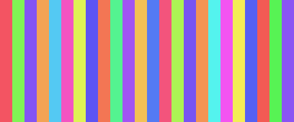
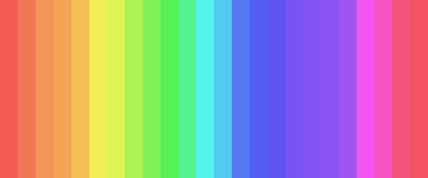

# Pretty Colors
Generate some decent looking colors without repeating similar colors.

Concept:
  The idea for this code is based on something I saw in the VI Hart video: https://www.youtube.com/watch?v=lOIP_Z_-0Hs.
Basically generate the next color by adding the golden angle to the HSV value of the previous color
which creates colors with minimal overlap of the hue.

#Output
Colors in order generated by pretty_color(i) for i from 0 to 23 function

 

Colors returned by pretty_colors(24)

 
